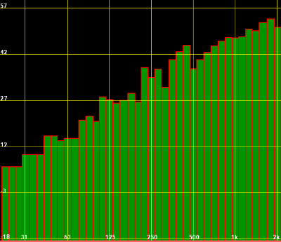

# Active Noise Cancellation for Windows using Audio Exciters

Project for ECE 209AS - Special Topics in Circuits and Embedded Systems: Artificial Intelligence and Machine Learning for IoT and HCPS.

## Background

Loud environments created by busy roads, airports, or otherwise heavily trafficked locations can negatively affect the health and productivity of individuals in nearby buildings. Out of all the surfaces in a building, windows generally transmit the most noise from outside and are difficult to insulate against sound. This project investigates an active noise cancellation system that uses audio exciters to reduce noise levels transmitted into buildings.

## Goals and Specific Aims

The goal of this project is to investigate the feasibility of an affordable active noise cancellation system that reduces noise levels transmitted into buildings.

The first major component of this project is to develop an effective, low latency noise cancellation algorithm that runs on a Linux system. Active noise cancellation systems generally include specialized DSPs, so the latency limitations of a Linux-based system will need to be understood. Additionally, this project will explore using time series forecasting with neural networks to predict the cancellation waveform. The idea behind this approach is that a neural network will be able to learn and adapt to the different dynamics at play in the system, as well as respond to predictable noises with higher accuracy.

The second component is integrating the processing power, amplifiers, microphones, and audio exciters together, and identify the limitations involved with the hardware. Additionally, the different hardware components all have different frequency responses which need to be taken into consideration so the algorithms can compensate accordingly.

## Technical Approach

### Hardware List

Compute
* [Raspberry Pi 4B (4GB)](https://www.raspberrypi.org/products/raspberry-pi-4-model-b/)

Audio
* [8W Shure Electronics amplifier board](https://www.parts-express.com/Sure-AA-AB32231-2x8W-at-4-Ohm-TPA3110-Class-D-Audio-Amplifier-Board-Only-320-329)
* [5W Dayton Audio audio exciter pair](https://www.parts-express.com/Dayton-Audio-DAEX25-Sound-Exciter-Pair-300-375)
* Approach 1: [Audio injector sound card](http://www.audioinjector.net/rpi-hat) + [electret microphone](https://www.adafruit.com/product/1063) x2
* Approach 2: [I2S MEMS microphone](https://www.adafruit.com/product/3421) x2

### Software Libraries

[ALSA](https://bugtrack.alsa-project.org/wiki/Main_Page) (Advanced Linux Sound Architecture) is the low-level audio driver used for audio capture and playback.

[JACK](https://jackaudio.org/) (JACK Audio Connection Kit) is a low-latency audio server on Linux, and for this project it is used to help calculate hardware latency.

The noise cancellation algorithm uses the [Keras/Tensorflow](https://www.tensorflow.org/api_docs/python/tf/keras) machine learning framework for training, and [TFLite](https://www.tensorflow.org/lite) for execution.

## Implementation and Experiments

### Linux Audio Processing

Audio processing on the Raspberry Pi is done using the ALSA APIs. ALSA (Advanced Linux Sound Architecture) is a low-level interface for sound devices on Linux systems.

The following resources give a good overview of how to work with ALSA:
* [Introduction to Sound Programming with ALSA](https://www.linuxjournal.com/article/6735) by Jeff Tranter
* [A Tutorial on Using the ALSA Audio API](http://equalarea.com/paul/alsa-audio.html) by Paul Davis
* [Programming and Using Linux Sound](https://jan.newmarch.name/LinuxSound/) ([ALSA chapter](https://jan.newmarch.name/LinuxSound/Sampled/Alsa/)) by Jan Newmarch

The key points that affect low latency systems are the potential limitations to settings such as channel number, sample rate, format, and buffer sizes, all of which depend on hardware support. In some cases, ALSA can automatically resample or otherwise modify the stream in real-time to meet certain setting requirements (at the cost of CPU overhead), but there are still limitations. Most importantly, minimum period size is limited, meaning the buffers can only be read or updated after a certain number of samples.

#### ALSA Latency

To understand the period size limitation and its effect on latency, the way ALSA structures its data needs to be understood. ALSA structures its input and output data in samples, frames, periods, and buffers. A sample is one unit of data for one channel, and may range between 8 and 32 bits, depending on hardware support. A frame includes samples for both the left and right channels (assuming a two channels system in interleaved mode). A period contains a certain number of frames, and only after each period can a hardware interrupt be generated to refresh the data. Finally, the buffer contains multiple periods.

 
Figure 1: ALSA buffer structure

ALSA includes a [latency test](https://www.alsa-project.org/main/index.php/Test_latency.c) that finds the read latency of playback and capture devices. Latency cannot be measured between the I2S capture device and the 3.5mm playback device (the final configuration used with [simple_anc.c](https://github.com/joshuacrook/ECE209AS/blob/main/pi/simple_anc.c)) on the Raspberry Pi, but it can run using I2S as both the capture and playback device. For unknown reasons, [latency.c](https://github.com/joshuacrook/ECE209AS/blob/main/pi/helpers/latency.c) assigns the minimum period size for the I2S devices as 64 frames, even though they support down to 32 frames as returned by `snd_pcm_hw_params_get_period_size_min`. Output from [latency.c](https://github.com/joshuacrook/ECE209AS/blob/main/pi/helpers/latency.c) shows the maximum read latency is exactly 1/frequency * samples, which supports the statement earlier that captured data can only be read once per period.

For this project, a working period size of 32 frames was achieved for the I2S capture device, but only 256 frames for the playback device. It is unclear why the minimum assignable frame size is 256 for the playback device when `snd_pcm_hw_params_get_period_size_min` returns 80. Regardless, operating the capture device at 32 frames and the playback device at 256 frames does not create any adverse effects. Perhaps the playback device is interrupted when `snd_pcm_writei` is called so it does not attempt to play all 256 frames. Period sizes as small as 8 frames have been achieved by others with a BeagleBone Black and Audio Cape [[1](https://github.com/joshuacrook/ECE209AS#References)].

The table below shows the read latencies and frequencies at different sampling rates and frame counts.

| Frames | Sampling rate | Latency (us) | Latency (ms) | Frequency   |
| ------ | ------------- | ------------ | ------------ | ----------- |
| 32     | 48000         | 666.667      | 0.666667     | 1500.000 Hz |
|        | 44100         | 725.624      | 0.725624     | 1378.125 Hz |
|        | 22050         | 1451.247     | 1.451247     | 689.063 Hz  |
|        | 16000         | 2000.000     | 2.000000     | 500.000 Hz  |
| 64     | 48000         | 1333.333     | 1.333333     | 750.000 Hz  |
|        | 44100         | 1451.247     | 1.451247     | 689.063 Hz  |
|        | 22050         | 2902.494     | 2.902494     | 344.531 Hz  |
|        | 16000         | 4000.000     | 4.000000     | 250.000 Hz  |

### Playback Hardware

The audio exciter is mounted slightly offset as recommended by Dayton Audio in their [installation guide](https://www.daytonaudio.com/topic/excitersbuyerguide).

 
Figure 2: Installed audio exciter

#### Sound Card Latency

The Audio Injector sound card latency measured with JACK has an average of 0.8059 ms, but ranges from 0.5833 ms - 0.9750 ms depending on the sample rate and period size. Measurements with identical parameters return identical latencies, and it is possible the variation is due to restrictions with JACK itself rather than the hardware. For subsequent latency calculations, hardware latency is assumed to be 32 frames at 48000 Hz.

#### Additional Issues

Additional issues are apparent when the audio exciter is mounted on the window. The main issue is that standing waves result in different frequency responses on different parts of the window pane. The overall frequency response of the audio exciter when mounted is nothing special (see Figure 3), but at close range the response varies greatly.

 
Figure 3: Window frequency response with audio exciter

For one test, a 200 Hz sine wave is played into the window. Measurements show that the sound level varies from 53-61 dB(A) depending on the location on the window. This is a huge variation that is noticeable when near the window.

Another issue is that noise can come from different directions, arriving at different parts of the window at different times.

Potential solutions to both of these problems could include using an array of microphones and audio exciters. More tests would need to be done in a controlled environment.

### ANC Algorithm

As mentioned previously, the ANC algorithm is a neural network trained with Keras/Tensorflow and executed with TFLite on the Raspberry Pi. In order to facilitate training and testing, [test_anc.py](https://github.com/joshuacrook/ECE209AS/blob/main/test_anc.py) allows for data to be generated for models with different numbers of inputs, output predictions and offsets. The script will then train the model for a given architecture (which can also be easily changed), test accuracy, save residual noise for listening, and save the TFLite model for execution and testing latency on the Raspberry Pi.

The naive approach in [simple_anc.c](https://github.com/joshuacrook/ECE209AS/blob/main/pi/simple_anc.c) uses bitwise NOT (`~`) to take the complement of the integer sample, which is equivalent to inverting it. This approach is used to analyze the effectiveness of ANC with different amounts of latency, but it would not work in the dynamic system described here since the indoor noise is different from the outdoor noise, and the frequency response of the components differ as well.

#### Data Collection

The main microphone is placed outside the window and measures the incoming noise. A second microphone used during training is placed inside to measure the noise that passes through the window. The indoor noise will help train the ANC algorithm to consider the attenuation caused by the glass. Unfortunately, due to lack of time, training models with indoor noise was not done.

##### Approach 1

The first approach is to use an [Audio Injector sound card](http://www.audioinjector.net/rpi-hat) and [electret microphones](https://www.adafruit.com/product/1063). The exact brand of microphone does not matter, it is just an electret microphone with a MAX4466 amplifier and adjustable gain. The adjustable gain puts the output voltages in an appropriate range for line level applications. Instructions for setting up the Raspberry Pi to use the Audio Injector sound card can be found on their [GitHub](https://github.com/Audio-Injector/stereo-and-zero).

In practice, especially when recording in quiet environments, the noise can overpower the target sound. As seen in the [datasheet](https://cdn-shop.adafruit.com/datasheets/CMA-4544PF-W.pdf), the electret microphone has a signal-to-noise ratio (SNR) of 60 dBA. 60 dBA by itself is not terrible, but the noise is then amplified by the MAX4466. Additionally, the MAX4466 introduces some noise by itself ([datasheet](https://cdn-shop.adafruit.com/datasheets/MAX4465-MAX4469.pdf)), compounding the issue.

Tests show the microphone works fine to detect loud, outdoor sounds, but the noise overpowers the quieter indoor sounds that are required for training.

##### Approach 2

The second approach takes advantage of the Raspberry Pi's I2S support with [I2S MEMS microphone](https://www.adafruit.com/product/3421). As seen in the [datasheet](https://cdn-shop.adafruit.com/product-files/3421/i2S+Datasheet.PDF), the MEMS microphone has a slightly better signal-to-noise ratio (SNR) of 64 dBA, but the real improvement is that it is digital, so the noise is not amplified or compounded with noise from an amplifier. There is still noise in quiet environments, but it is an improvement over the previous approach. Microphone setup and installation instructions can be found on [Adafruit's guide](https://learn.adafruit.com/adafruit-i2s-mems-microphone-breakout/raspberry-pi-wiring-test).

Compared to the first approach, the indoor microphone for this approach has much less noise, but is still not perfect. Additional preprocessing steps may need to be done to clean up noise in the indoor data for training.

#### Algorithm Latency

The latency of simple linear, multilayer perceptron, CNN and LSTM networks is tested with an input size of 32 samples and an output size of 1 and 8 (see [test_model.py](https://github.com/joshuacrook/ECE209AS/blob/main/pi/test_model.py)). This includes the time Python takes to reshape the input data.

| Output samples | Linear    | MLP       | CNN       | LSTM     |
| -------------- | --------- | --------- | --------- | -------- |
| 1              | 25.51 kHz | 21.20 kHz | 13.19 kHz | 0.80 kHz |
| 8              | 201.0 kHz | 171.1 kHz | 107.8 kHz | 6.5 kHz  |

As seen above, the processing time required for can be significantly faster than the sampling rate when predicting multiple outputs with a simple model.

The latency of the naive ANC algorithm is negligible.

### ANC Performance Analysis

[test_anc.py](https://github.com/joshuacrook/ECE209AS/blob/main/test_anc.py) can test naive and neural network based ANC algorithms while taking overall system delay into account. The `WindowGenerator` class and other elements are inspired by TensorFlow's [Time series forecasting guide](https://www.tensorflow.org/tutorials/structured_data/time_series). The tests use `out_61_quiet_outside.wav` at a sample rate of 48000 Hz and assume a 64-frame delay. The 64-frame delay comes from the minimum period size of 32 frames, plus an estimated 32 frame delay for the hardware. Audacity's Plot Spectrum tool is used to visualize the ideal anti-noise (`out_truth.wav`) and compare it with the residual noise (`out_nn_anc_delay.wav` and `out_naive_anc_delay.wav`) that is left over after summing the original noise with the anti-noise waveform.

 
Figure 4: Anti-noise ground truth (out_truth.wav)

#### Naive ANC

With a 64-frame delay, naive ANC performs well until about 150 Hz, at which point it is actually adding more noise to the system than cancelling. The reason for this is that the delay is so large that it is shifting certain frequencies so they are reinforcing instead of cancelling the noise with that frequency. This is seen in multiple locations with peaks of high noise.

 
Figure 5: Naive ANC with 64-frame delay

With an impossibly low 8-frame delay (impossible because the measured hardware delay alone is 32 frames), performance is much better up until about 1000 Hz, then the residual waveform starts adding small amounts of of noise.  Although this is still a relatively low frequency, most traffic noise coming through windows is well below this frequency.

 
Figure 6: Naive ANC with 8-frame delay

#### Neural Network Based ANC

This project focused on Linux audio processing and latency, but it was also made to be able to accommodate neural network based ANC algorithms. Below are examples using a very simple CNN: a Conv1D layer with 32 filters and a kernel size of 3 followed by a dense layer. The simple model architectures in [test_anc.py](https://github.com/joshuacrook/ECE209AS/blob/main/test_anc.py) are inspired by results from the paper Long Short-Term Memory and Convolutional Neural Networks for Active Noise Control [[2](https://github.com/joshuacrook/ECE209AS#References)]. The model architecture has not been optimized and the performance is terrible, but it is included since it is part of potential next steps for the project.

Figure 7 shows the results of the model taking 32 frames as input and attempting to predict 32 frames (one period) at a time 64 frames into the future to account for all the delay. Due to the simplicity of the model, the prediction accuracy is low and results in much more noise in the higher frequencies. If only considering very low frequencies (<150 Hz), this model performs slightly better than the naive ANC algorithm.

 
Figure 7: NN ANC with 64-frame delay

Figure 8 shows what the result would look like taking 16 frames as input and predicting 16 frames at a time (assuming the period can be brought down to 16 frames), 48 frames in the future (accounting for the 16 from the driver delay and 32 from the hardware delay). Although better at lower frequencies, the smaller period size reintroduces the issue with peaks caused by some frequencies being reinforced, something to keep in mind.

 
Figure 8: NN ANC with 48-frame delay

### Performance Conclusion

Naive ANC requires unattainably low latency (~8 frames total) to work effectively in this situation. Alternative algorithms, possibly those based on neural networks, will need to be explored to make the system effective. Lower latency hardware may also be required.

## Prior Work

[DeNoize](https://denoize.com/) is a start-up developing a similar technology, but publicly available technical details are limited.

[Sono noise cancelling system](https://www.ippinka.com/blog/sono-peace-quiet-home/) is a concept design that attempts to cancel noise using a similar approach, by mounting a device inside of a window, but it does not look like serious technical research or prototypes were ever produced.

[Directional cancellation of acoustic noise for home window applications](https://www.sciencedirect.com/science/article/abs/pii/S0003682X12002599) by S. Hu, R. Rajamani, X. Yu is also similar, but focuses on using two microphones to distinguish between indoor and outdoor noise.

[Active control of broadband sound through the open aperture of a full-sized domestic window](https://www.researchgate.net/publication/342821305_Active_control_of_broadband_sound_through_the_open_aperture_of_a_full-sized_domestic_window) by Bhan Lam, Dongyuan Shi, Woon-Seng Gan, Stephen J. Elliott & Masaharu Nishimura attempts to cancel noise through open windows using an array of speakers and microphones.

## Future Work

The most important next step would be to explore processing hardware that has lower latencies. This could include a BeagleBone, sound cards that support smaller periods, or even baremetal/RTOS systems.

If high latency is unavoidable, more advanced neural networks that can predict audio further in the future should be explored. Accurately predicting further into the future could make up for delays caused by the driver or hardware. Neural network accelerators such as the Neural Compute Stick 2 could improve inference speed of more complex networks.

Finally, the audio exciters need to be tested in a controlled environment. A manually generated noise source in an otherwise quiet environment would greatly help measure frequency responses and overcome issues cause by directional noise and standing waves. Potential solutions could include using an array of microphones and audio exciters, and tune the system to be able to handle these issues.

## References

[1] Topliss, J., Zappi, & McPherson, A.P. (2014). Latency Performance for Real-Time Audio on BeagleBone Black. 
https://api.semanticscholar.org/CorpusID:3305184

[2] S. Park, E. Patterson and C. Baum, "Long Short-Term Memory and Convolutional Neural Networks for Active Noise Control," 2019 5th International Conference on Frontiers of Signal Processing (ICFSP), Marseille, France, 2019, pp. 121-125, doi: 10.1109/ICFSP48124.2019.8938042. 
https://ieeexplore.ieee.org/document/8938042